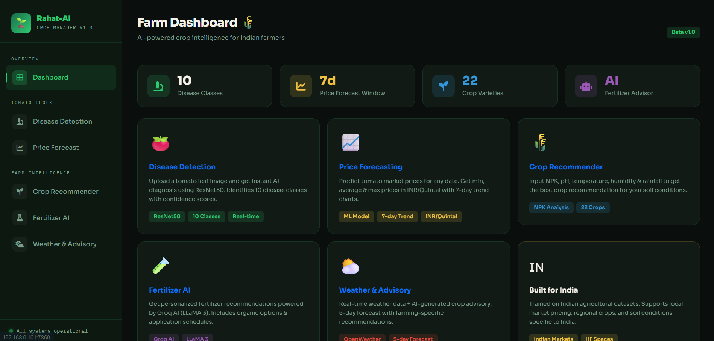
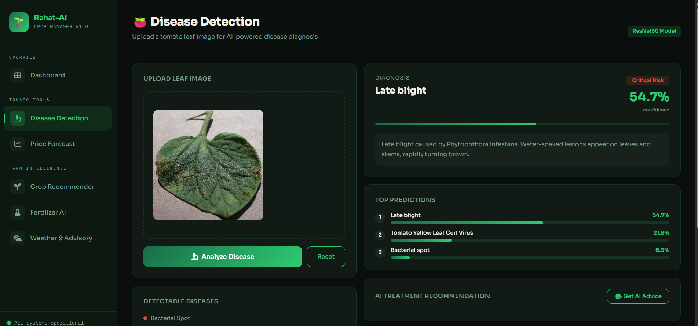
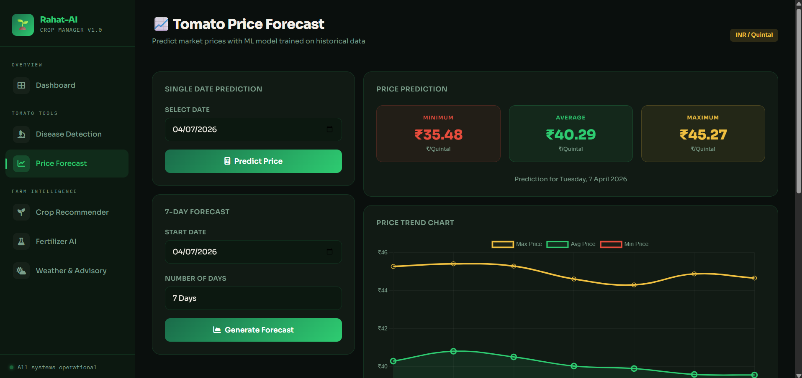
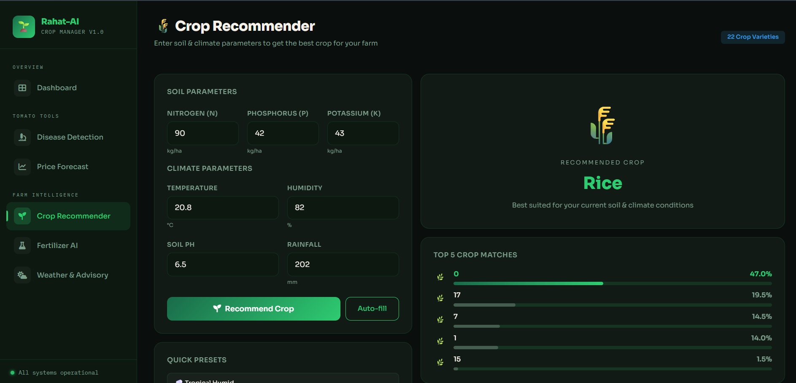
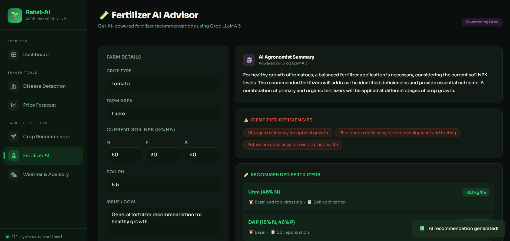

# 🌱 Rahat-AI — Crop Manager

> An AI-powered precision agriculture platform for tomato farmers, combining real-time weather data, disease detection, price forecasting, and smart fertilizer recommendations — all in one dark-themed web dashboard.


---

## 📸 Screenshots

### 🏠 Dashboard & Weather Advisory

> Real-time weather data for any city with 5-day forecast and AI crop advisory

---

### 🍃 Disease Detection

> Upload a tomato leaf image → ResNet50 diagnosis → AI treatment recommendation

---

### 📊 Tomato Price Forecast

> ML-powered price prediction with min/avg/max values and 7-day trend chart

---

### 🌿 Crop Recommender

> Input soil & climate parameters to get the best crop match from 22 varieties

---

### 🧪 Fertilizer AI

> Soil deficiency detection with fertilizer plan, application schedule, and cost estimate

---

## 🚀 Features

### 🍅 Tomato Tools

| Feature | Description |
|---|---|
| **Disease Detection** | Upload a tomato leaf image and get AI-powered diagnosis using a ResNet50 model. Detects 10 disease classes including Late Blight, Bacterial Spot, Mosaic Virus, and more. |
| **Price Forecast** | ML-based tomato market price prediction (INR/Quintal). Supports single-date and 7-day range forecasts with trend charts. |

### 🌾 Farm Intelligence

| Feature | Description |
|---|---|
| **Crop Recommender** | Input soil NPK, pH, temperature, humidity, and rainfall to get the best-fit crop from 22 varieties. |
| **Fertilizer AI** | AI-driven fertilizer recommendations based on crop type, farm area, soil NPK, and pH. Includes application schedule and cost estimate. |
| **Weather & Advisory** | Real-time weather via OpenWeather API + AI crop advisory for any city. Includes 5-day forecast and irrigation/pest risk insights. |

---

## 🛠️ Tech Stack

| Layer | Technology |
|---|---|
| **Backend** | Python 3.9+, Flask |
| **Disease Detection** | TensorFlow / Keras — ResNet50 (10 disease classes) |
| **Price Forecasting** | scikit-learn ML regression model (joblib) |
| **Crop Recommendation** | scikit-learn classification model (joblib) |
| **AI Advisory** | Groq API — Llama 3.3 70B Versatile |
| **Weather** | OpenWeather API (current + 5-day forecast) |
| **Frontend** | HTML, CSS, JavaScript (Jinja2 templates, dark theme) |
| **Containerization** | Docker |

---

## ⚙️ Installation & Setup

### Prerequisites

- Python ≥ 3.9
- pip
- A [Groq API key](https://console.groq.com) (for fertilizer AI & crop advisory)
- An [OpenWeather API key](https://openweathermap.org/api) (for weather data)

### 1. Clone the repository

```bash
git clone https://github.com/KshitijT15/Rahat_ai_crop_manager.git
cd Rahat_ai_crop_manager
```

### 2. Install dependencies

```bash
pip install -r requirements.txt
```

### 3. Configure environment variables

Create a `.env` file in the root directory:

```env
GROQ_API_KEY=your_groq_api_key_here
OPENWEATHER_API_KEY=your_openweather_api_key_here
```

> Get your Groq API key at [console.groq.com](https://console.groq.com)  
> Get your OpenWeather API key at [openweathermap.org](https://openweathermap.org/api)

### 4. Add ML model files

Place your trained model files in a `models/` directory:

```
models/
├── model.weights.h5              # ResNet50 disease detection weights
├── tomato_price_model.pkl        # Tomato price prediction model
├── crop_recommendation_model.joblib  # Crop recommendation model
└── crop_scaler.pkl               # Feature scaler for crop model (optional)
```

> **Note:** If model files are missing, the app runs in demo mode with simulated predictions.

### 5. Run the development server

```bash
python app.py
```

Open [http://localhost:7860](http://localhost:7860) in your browser.

---

## 🐳 Docker Setup

```bash
# Build the image
docker build -t rahat-ai .

# Run the container
docker run -p 7860:7860 \
  -e GROQ_API_KEY=your_key_here \
  -e OPENWEATHER_API_KEY=your_key_here \
  rahat-ai
```

---

## 🧭 Navigation

```
Rahat-AI
├── Overview
│   └── Dashboard
├── Tomato Tools
│   ├── Disease Detection
│   └── Price Forecast
└── Farm Intelligence
    ├── Crop Recommender
    ├── Fertilizer AI
    └── Weather & Advisory
```

---

## 🔬 Module Details

### 🍃 Disease Detection

- Upload a tomato leaf image (up to 16 MB)
- ResNet50 model classifies among **10 disease categories**:
  - Bacterial Spot, Early Blight, Late Blight, Leaf Mold
  - Septoria Leaf Spot, Spider Mites, Target Spot
  - Yellow Leaf Curl Virus, Mosaic Virus, Healthy
- Displays confidence score and top-3 predictions
- AI treatment recommendation with severity level and precautions

### 📊 Price Forecast

- Predicts tomato prices in **INR/Quintal**
- **Single-date prediction:** select any future date
- **7-day forecast:** generates min, avg, max price trend
- Visual trend chart for easy interpretation

### 🌿 Crop Recommender

- Input parameters: N, P, K (kg/ha), temperature (°C), humidity (%), soil pH, rainfall (mm)
- Recommends best crop from **22 varieties** including rice, maize, legumes, fruits, and cash crops
- Shows top-5 crop matches with confidence scores
- Quick presets for common climate profiles

### 🧪 Fertilizer AI

- Input: crop type, farm area, current soil NPK, pH, issue/goal
- Identifies soil deficiencies automatically via Groq LLM
- Recommends fertilizers (Urea, DAP, MOP, FYM, Vermicompost) with dosage
- Provides a stage-wise application schedule (Sowing → Fruiting → Fruit Development)
- Estimated cost range in INR

### 🌤️ Weather & Advisory

- Search by **city name** or use **GPS location**
- Real-time data: temperature, humidity, wind, cloud cover, visibility, pressure, sunrise/sunset
- 5-day weather forecast
- AI crop advisory powered by **Groq (Llama 3.3 70B)**: immediate actions, irrigation tips, pest/disease risk, harvest advice

---

## 📁 Project Structure

```
Rahat_ai_crop_manager/
├── app.py                   # Main Flask application & API routes
├── inspect_weights.py       # Utility to inspect model weight shapes
├── requirements.txt         # Python dependencies
├── Dockerfile               # Docker container configuration
├── .gitignore
├── models/                  # ML model files (not committed)
│   ├── model.weights.h5
│   ├── tomato_price_model.pkl
│   ├── crop_recommendation_model.joblib
│   └── crop_scaler.pkl
├── templates/               # Jinja2 HTML templates
│   ├── index.html           # Dashboard
│   ├── disease.html         # Disease detection page
│   ├── price.html           # Price forecast page
│   ├── crop.html            # Crop recommender page
│   ├── fertilizer.html      # Fertilizer AI page
│   └── weather.html         # Weather & advisory page
└── screenshots/             # App screenshots for documentation
```

---

## 🌐 API Endpoints

| Method | Endpoint | Description |
|---|---|---|
| `POST` | `/api/predict-disease` | Disease detection from uploaded leaf image |
| `POST` | `/api/predict-price` | Tomato price prediction for a single date |
| `POST` | `/api/predict-price-range` | 7-day tomato price forecast |
| `POST` | `/api/recommend-crop` | Best crop recommendation from soil/climate data |
| `POST` | `/api/fertilizer-recommendation` | AI fertilizer plan via Groq |
| `POST` | `/api/weather` | Current weather + 5-day forecast via OpenWeather |
| `POST` | `/api/crop-advisory` | AI crop advisory based on weather via Groq |

---

## 🤝 Contributing

Contributions are welcome! Please follow these steps:

1. Fork the repository
2. Create a new branch: `git checkout -b feature/your-feature-name`
3. Make your changes and commit: `git commit -m "Add your feature"`
4. Push to your branch: `git push origin feature/your-feature-name`
5. Open a Pull Request

---

## 📄 License

This project is licensed under the MIT License. See [LICENSE](LICENSE) for details.

---

## 👨‍💻 Author

**Kshitij T.** — [@KshitijT15](https://github.com/KshitijT15)

---

## 🙏 Acknowledgements

- [OpenWeather API](https://openweathermap.org/) for real-time weather data
- [Groq](https://groq.com/) for blazing-fast LLM inference (Llama 3.3 70B)
- [ResNet50](https://arxiv.org/abs/1512.03385) architecture for disease classification
- [PlantVillage Dataset](https://plantvillage.psu.edu/) for tomato disease training data
- All contributors and the open-source community

---

> *Rahat-AI — Bringing precision agriculture to every farmer's fingertips.* 🌾
